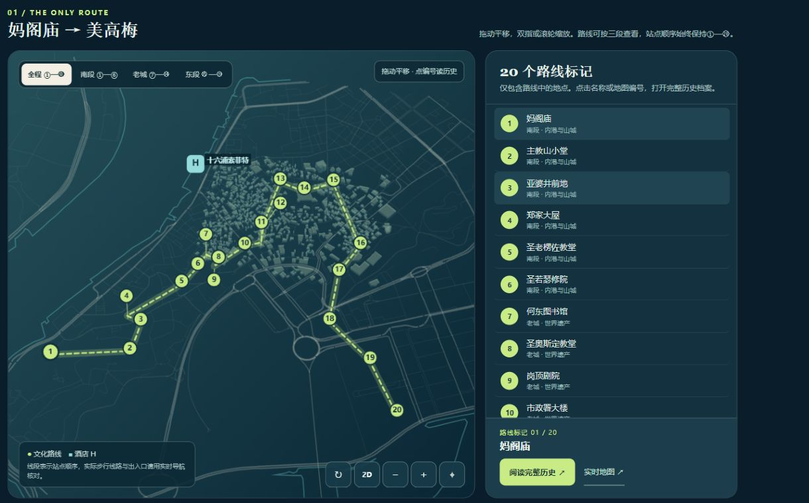

# 澳门立体路线地图

一个无需构建步骤的澳门静态地图。它按指定顺序展示 20 个路线标记，每站可以打开完整历史说明；收藏店铺以独立卡片呈现，澳门十六浦索菲特酒店以 `H` 独立标在地图上。

[在线打开地图](https://kkenny0.github.io/macao-route-atlas/)



## 使用

直接打开仓库根目录的 `index.html`，或运行：

```bash
python3 -m http.server 8000
```

然后访问 `http://localhost:8000/`。不需要 API Key、构建工具或在线地图服务；点击外部资料、店铺实时地图和酒店官网时需要联网。

地图支持拖动平移、滚轮或双指缩放、旋转、切换 2D/3D 视角，以及全程和三段视图。点击地图编号或右侧站点名称可以阅读历史档案，档案内可按顺序切换上一站和下一站。

## 路线与内容

1. 妈阁庙 → 主教山小堂 → 亚婆井前地 → 郑家大屋 → 圣老楞佐教堂 → 圣若瑟修院 → 何东图书馆
2. 圣奥斯定教堂 → 岗顶剧院 → 市政署大楼 → 仁慈堂 → 玫瑰圣母堂 → 大三巴牌坊 → 大炮台
3. 疯堂斜巷 → 东望洋新街 → 加思栏花园 → 老葡京 → 永利澳门 → 美高梅

线段表达站点先后关系，**不是实际步行导航**。街道、出入口、开放时间以及店铺是否营业，请以当时的实时地图和现场信息为准。建筑高度仅用于立体效果。

| 文件 | 内容 |
| --- | --- |
| `index.html` | 页面结构、入口和地图署名 |
| `src/styles.css` | 页面样式与响应式布局 |
| `src/app.js` | 地图绘制、视角控制、站点及历史档案交互 |
| `data/content.js` | 20 站史料、独立店铺列表、酒店标记 |
| `data/map.js` | 离线地图几何数据 |

店铺名称可在 `data/content.js` 的 `shops` 中维护。路线地点在同文件的 `route` 中按数组顺序排列；调整顺序时也要同步检查编号、阶段和历史档案翻页逻辑。

## GitHub Pages

本站从 `main` 分支的根目录发布。推送改动后，GitHub Pages 会重新发布页面；入口为根目录的 `index.html`。

## 资料与使用范围

- 地图几何数据来自 [OpenStreetMap contributors](https://www.openstreetmap.org/copyright)，按 [Open Database License 1.0](https://opendatacommons.org/licenses/odbl/1-0/) 标识；公开页面底部也保留署名。地图数据位于 `data/map.js`。
- 各站历史说明在弹出的档案中分别附有资料入口。页面底部另有[澳门旅游局世界遗产资料](https://www.macaotourism.gov.mo/zh-hans/sightseeing/macao-world-heritage)入口。
- 本仓库暂未为自有代码和文案添加单独的开源许可。公开版本不包含原收藏页的个人分享参数及上传照片。
